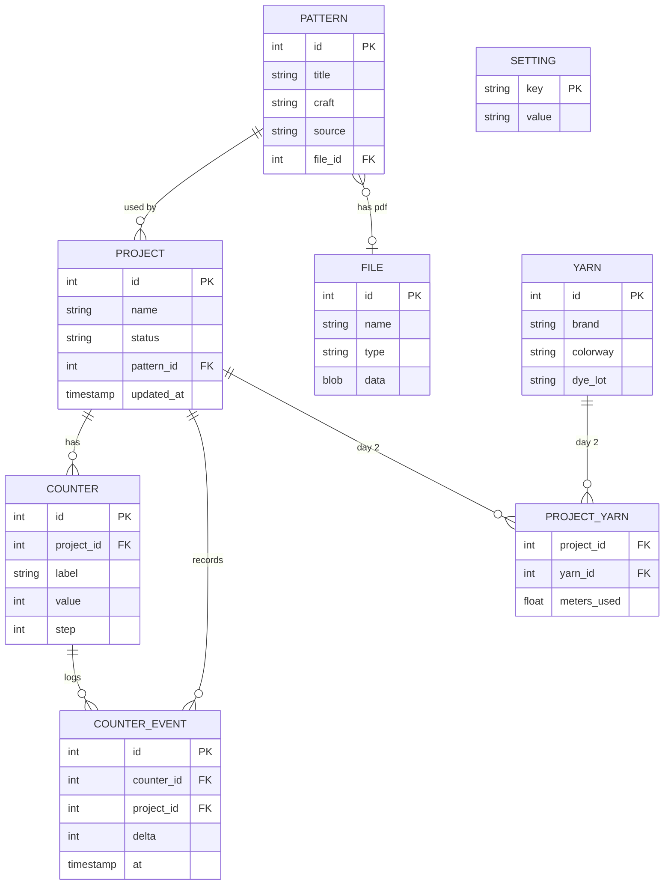

# Schema diagram

GitHub draws this automatically. The yarn tables are planned for Day 2.

```mermaid
erDiagram
  PATTERN ||--o{ PROJECT : "used by"
  PATTERN }o--o| FILE : "has pdf"
  PROJECT ||--o{ COUNTER : has
  COUNTER ||--o{ COUNTER_EVENT : logs
  PROJECT ||--o{ COUNTER_EVENT : records
  PROJECT ||--o{ PROJECT_YARN : "day 2"
  YARN ||--o{ PROJECT_YARN : "day 2"
  PATTERN { int id PK
    string title
    string craft
    string source
    int file_id FK }
  PROJECT { int id PK
    string name
    string status
    int pattern_id FK
    timestamp updated_at }
  COUNTER { int id PK
    int project_id FK
    string label
    int value
    int step }
  COUNTER_EVENT { int id PK
    int counter_id FK
    int project_id FK
    int delta
    timestamp at }
  FILE { int id PK
    string name
    string type
    blob data }
  YARN { int id PK
    string brand
    string colorway
    string dye_lot }
  PROJECT_YARN { int project_id FK
    int yarn_id FK
    float meters_used }
  SETTING { string key PK
    string value }
```
